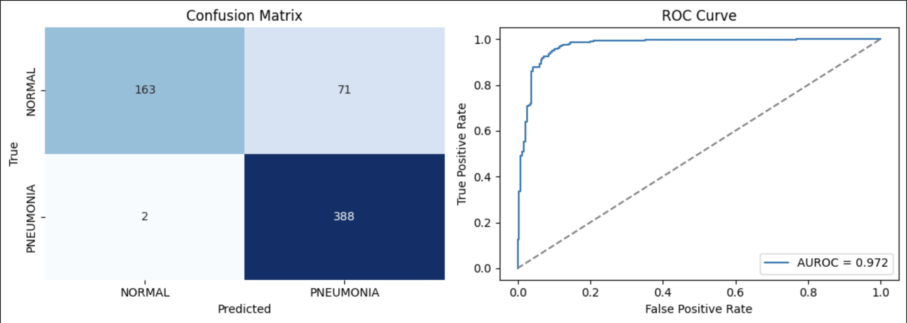
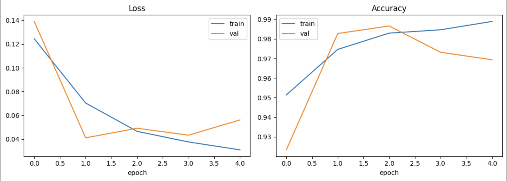
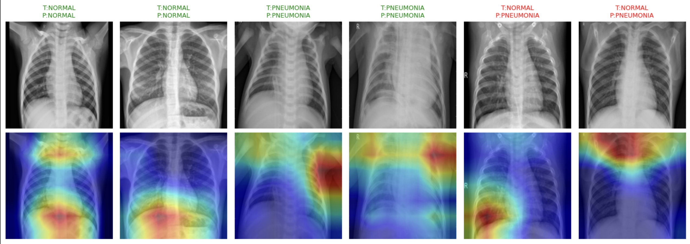
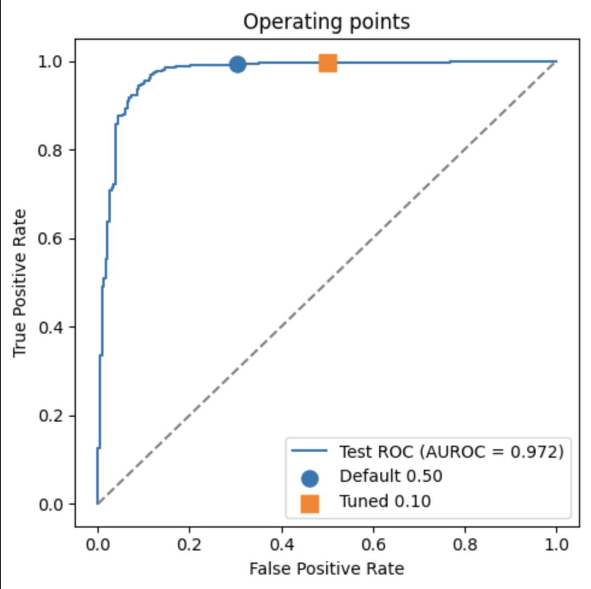
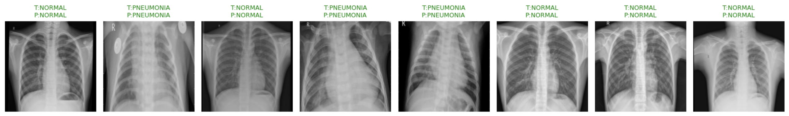

# Chest X-ray Pneumonia Classifier

A convolutional neural network (**ResNet-18**, transfer learning) that classifies paediatric chest X-rays as **Normal** or **Pneumonia**, with class-imbalance handling, AUROC-based evaluation, Grad-CAM explainability, and an honest analysis of its real-world limitations.

> **Research and educational use only.** This is not a medical device and must not be used for clinical decision-making.

---

## Overview

Pneumonia is a leading cause of paediatric hospital admission, and chest radiography is central to its diagnosis. This project fine-tunes an ImageNet-pretrained ResNet-18 to distinguish normal from pneumonic paediatric chest X-rays, and — more importantly — evaluates it the way a clinical screening tool should be evaluated: with threshold-independent discrimination (AUROC), an explicit sensitivity/specificity trade-off, and an explainability check for shortcut learning.

## Dataset

[Chest X-ray Pneumonia (Kaggle)](https://www.kaggle.com/datasets/paultimothymooney/chest-xray-pneumonia) — paediatric patients aged 1–5 from Guangzhou Women and Children's Medical Center.

- Training images: 5,216 (≈1 Normal : 3 Pneumonia — a notable class imbalance)
- Test images: 624 (held out, used only for final evaluation)

The dataset ships with a built-in validation folder of only **16 images**, which is far too small to be meaningful. It is therefore discarded, and a **stratified 90/10 validation split** is carved from the training data instead (preserving the class ratio).

## Methods

| Component | Choice | Why |
|---|---|---|
| Architecture | ResNet-18, ImageNet-pretrained | Strong, lightweight transfer-learning baseline |
| Preprocessing | Resize 224, **ImageNet normalization** | Pretrained weights expect normalized inputs |
| Augmentation | Random horizontal flip + rotation (train only) | Improves generalisation without distorting test data |
| Class imbalance | Inverse-frequency class weights in the loss | Stops the model defaulting to the majority class |
| Optimiser | AdamW, lr 1e-4 | Stable fine-tuning |
| Training | Up to 12 epochs, early stopping (patience 3) on val loss | Best checkpoint saved and reloaded; avoids overfitting |
| Reproducibility | Fixed seed across `random`, `numpy`, `torch` | Identical train/val/test split on every run |

## Results (held-out test set)

Evaluated at the default 0.50 decision threshold:

| Metric | Value |
|---|---|
| **AUROC** | **0.972** |
| Sensitivity (pneumonia recall) | 0.995 |
| Specificity (normal recall) | 0.697 |
| Accuracy | 0.883 |
| F1 (Pneumonia) | 0.914 |
| F1 (Normal) | 0.817 |

Confusion matrix (test, n = 624): of 390 true pneumonia cases the model missed only **2**; of 234 true normals it correctly cleared **163** (71 false positives).



The strong AUROC (0.972) shows the model genuinely separates the two classes. At the default threshold it behaves as a **high-sensitivity screener**: it almost never misses pneumonia, at the cost of over-calling it on a minority of normal X-rays.

### Training curves



## Explainability (Grad-CAM)

Grad-CAM highlights the regions driving each prediction. The heatmaps concentrate on **thoracic anatomy and lung fields** rather than on text markers, image borders, or scanner artifacts — evidence *against* the "shortcut learning" failure mode that is well documented in chest X-ray models.



## Threshold analysis and the limits of this model

A natural next step is to tune the decision threshold to rebalance sensitivity and specificity. Selecting the threshold on the **validation set** with Youden's J chose a low cutoff (≈0.10); applying it to the test set actually *reduced* specificity (0.70 → 0.50) for no meaningful sensitivity gain (0.995 → 0.997). Both operating points are shown below.



This is a deliberate finding, and the reason is distribution shift: the validation split is drawn from the (easier) training distribution, where normal X-rays score very low, so the validation-optimal threshold is pushed low — exactly the wrong direction for the test set, whose normals score higher. An operating point calibrated on one distribution does not transfer to a shifted one, and tuning the threshold on the test set itself would be a methodological error. The default high-sensitivity operating point is therefore reported as the primary result, with threshold tuning shown as analysis rather than as a headline gain.

## Example predictions



## Limitations

- **Single-source paediatric data** (one hospital, ages 1–5); performance will not transfer to adults or other equipment/populations without re-validation.
- **Distribution shift** between the internal validation split and the official test set limits operating-point calibration (see above).
- **Specificity is modest** at the default threshold — the model favours catching pneumonia over correctly clearing normals.
- **Possible label noise** in the original dataset.
- **Not clinically validated.** Research and educational purposes only.

## How to run

1. Open `chest_xray_workbook.ipynb` in Google Colab.
2. `Runtime → Change runtime type → T4 GPU`.
3. Have your Kaggle API key (`kaggle.json`) ready; the notebook will prompt for it.
4. Run all cells top to bottom.

## Repository structure

```
chest-xray-pneumonia-ai/
├── chest_xray_workbook.ipynb   # full pipeline: data -> train -> evaluate -> explain
├── evaluation.png              # confusion matrix + ROC curve
├── training_curves.png         # loss/accuracy over epochs
├── gradcam_grid.png            # Grad-CAM explainability
├── threshold_tuning.png        # operating-point analysis
├── cxr_predictions_grid.png    # example predictions
└── README.md
```

## Future work

- Validate on an external, distribution-matched dataset to enable proper threshold calibration.
- Compare deeper backbones (ResNet-50, DenseNet-121) and test-time augmentation.
- Extend to multi-class (bacterial vs viral pneumonia).
